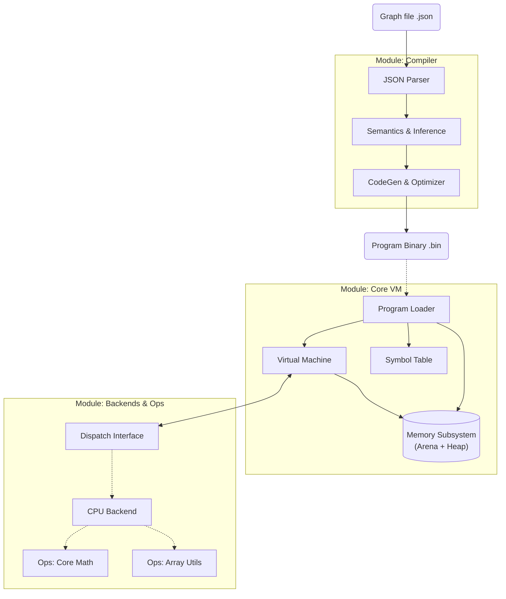

# MathFlow Architecture

MathFlow is a high-performance, **Data-Oriented** computation engine. It treats everything — from physics to UI layout — as mathematical operations on arrays (tensors).

> **Core Philosophy:** "The Graph is a Shader."
> Whether running on CPU (Interpreter) or GPU (Transpiled), the logic is pure math. The Host Application provides the Canvas and Inputs; the Graph calculates the State and Pixels.

## 1. System Overview

The project is structured as a **Monorepo** with strict decoupling between Definition (ISA), Translation (Compiler), and Execution (VM/Backend).

---

## 2. Modules

### 2.1. ISA (`modules/isa`)
*   **Role:** The "Contract". Defines the Instruction Set Architecture.
*   **Content:** Header-only definitions of Opcodes (`MF_OP_ADD`, `MF_OP_COPY`), Instruction Formats, and Binary Header structures.
*   **Versioning:** Includes a versioned binary format to ensure backward compatibility.

### 2.2. Virtual Machine (`modules/vm`)
*   **Role:** The Orchestrator & Memory Owner.
*   **Key Responsibilities:**
    *   **Symbol Table:** Maps human-readable names (`"u_Time"`) to Register Indices (`5`), enabling a robust Host API.
    *   **Memory Management:** Manages the Dual-Allocator system (Arena + Heap).
    *   **State Management:** Handles `Memory` nodes and Frame lifecycle (resetting transient data, persisting state).
    *   **Execution:** Iterates over the instruction list and delegates to the Backend via the Dispatch Table.

### 2.3. Compiler (`modules/compiler`)
*   **Role:** The Translator.
*   **Structure:**
    *   `mf_json_parser`: Converts JSON to Intermediate Representation (IR). Performs **Recursive Expansion** (Inlining) of Sub-Graphs.
    *   `mf_semantics`: Performs Shape Inference and Type Checking.
    *   `mf_codegen`: Topological Sort (Cycle Breaking for State nodes), Register Allocation, and Bytecode generation.
*   **Expansion Logic:** Sub-graphs are completely flattened during the parsing phase. The VM only sees a single linear list of instructions.

### 2.4. Backend: CPU (`modules/backend_cpu`)
*   **Role:** Reference Implementation (Software Renderer).
*   **Responsibility:** Initializes the Dispatch Table with CPU implementations.
*   **Capabilities:** Supports dynamic broadcasting and reshaping. Used for validation and software rendering.

### 2.5. Operations Libraries (`modules/ops_*`)
These modules contain the actual mathematical kernels. They are decoupled from the VM to allow easy reuse or replacement.
*   **`modules/ops_core`:** Basic arithmetic (`Add`, `Mul`), Trigonometry (`Sin`, `Atan2`), Logic (`And`, `Select`), Matrix ops (`MatMul`), and **State Relay** (`Copy`).
*   **`modules/ops_array`:** Array manipulation kernels (`Range`, `CumSum`, `Compress`).

---

## 3. Sub-Graphs (Modularity)

MathFlow supports modularity through a "Call-by-Inlining" mechanism. This allows creating complex logic from simple, reusable primitives.

### 3.1. The "Call" Node
A `Call` node references another `.json` file. During compilation, the parser:
1.  Loads the target graph.
2.  **Prefixing:** Adds the caller node's ID as a prefix to all internal nodes (e.g., `button_1::circle::sdf`) to ensure unique names.
3.  **Interface Mapping:**
    *   `ExportInput`: Maps parent `links` (by port index) to internal sub-graph entry points.
    *   `ExportOutput`: Maps internal results back to parent ports.
4.  **Flattening:** Merges the expanded node list into the main graph IR.

### 3.2. Relative Path Resolution
The compiler supports relative paths within sub-graphs. If `A.json` calls `B.json` and `B.json` calls `C.json`, the path to `C` is resolved relative to the location of `B`, enabling portable component libraries.

---

## 4. The "Pixel Engine" Concept

MathFlow is evolving into a system capable of rendering UI purely through mathematics (SDFs, Pixel Math), similar to a Fragment Shader.

### 3.1. I/O Protocol (Symbol Table)
Instead of relying on fragile indices, the Host Application interacts with the VM using Named Registers:
1.  **Host Initialization:** `time_reg = mf_vm_find_register(vm, "u_Time")`.
2.  **Per-Frame:** Write value to `time_reg`.
3.  **Execution:** `mf_vm_exec(vm)`.
4.  **Readback:** Read from `mf_vm_find_register(vm, "out_Color")`.

### 3.2. State Management
To support interactive UI (toggles, animations) without external logic, MathFlow implements internal state:
*   **`MF_NODE_MEMORY`:** Acts as a "delay" line. Outputs the value from the *previous* frame.
*   **Cycle Breaking:** The compiler treats Memory nodes as inputs (Roots) for the current frame to resolve dependency cycles.
*   **`MF_OP_COPY`:** At the end of the frame, the VM executes hidden copy instructions to update Memory nodes with new values for the next frame.

---

## 4. Memory Model

### 4.1. Dual-Allocator
1.  **Arena (Static):** Stores the Program (Code, Symbols) and Tensor Metadata.
2.  **Heap (Dynamic):** Stores Tensor Data. Supports `realloc` for dynamic resizing (e.g., when window resolution changes).

### 4.2. Tensor Ownership
*   **Constants:** Stored in the Program Binary (Arena).
*   **Variables:** Allocated in the VM Heap.
*   **View (Planned):** Support for referencing external memory (e.g., direct write to SDL Surface or GPU Buffer) to minimize copies.