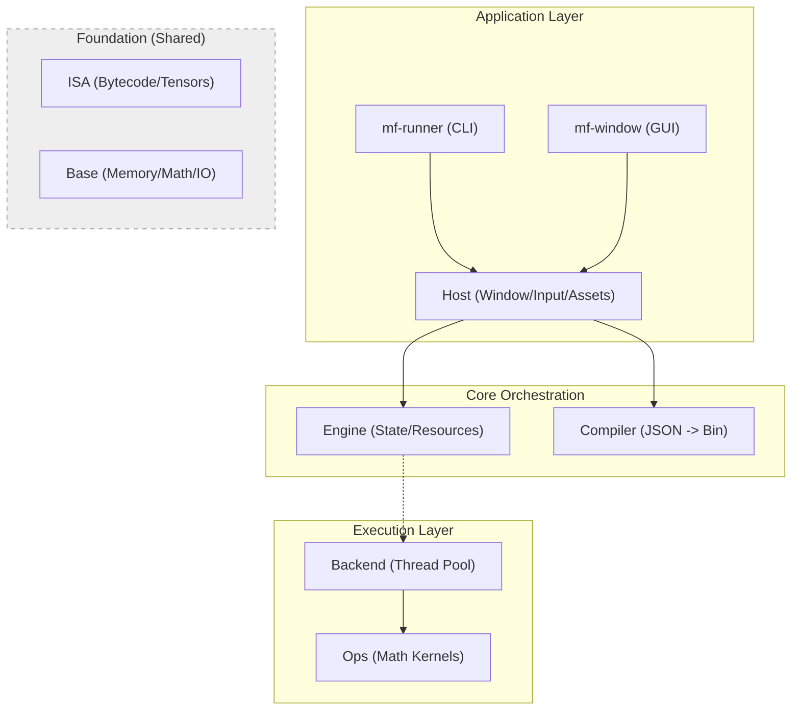

# MathFlow Architecture

MathFlow is a **Data-Oriented Computation Engine**. It is designed to process data streams (Tensors) efficiently by strictly separating the **definition** of logic from its **execution**.

## System Overview

The system is built as a layered hierarchy of modules. Lower layers (Base, ISA) have no dependencies on upper layers.



---

## Module Responsibilities

### 1. Foundation Layers

#### **Base** (`modules/base`)
*   **Role:** The bedrock. Zero external dependencies.
*   **Contents:**
    *   `mf_types.h`: Core typedefs (`f32`, `u8`, `mf_type_info`) and access modes.
    *   `mf_memory`: Dual-allocator system (Stack Arena + Heap).
    *   `mf_buffer`: Raw memory container (owns `void* data`).
    *   `mf_math`: Basic scalar math functions.
    *   `mf_log`: Logging subsystem.
    *   `mf_utils`: Common utilities (hashing, path manipulation, file IO, UTF conversion).

#### **ISA** (`modules/isa`)
*   **Role:** The "Contract" or Interface. Defines the data structures used to communicate between modules. Pure data, no logic.
*   **Contents:**
    *   `mf_program`: The compiled bytecode format.
    *   `mf_instruction`: Opcode definitions. Supports up to 3 source operands.
    *   `mf_tensor`: **The View**. A lightweight struct (`info`, `buffer*`, `offset`) pointing to data.
    *   `mf_state`: Holds registers (tensors) for a running program.

#### **Ops** (`modules/ops`)
*   **Role:** The "Standard Library" of math functions. Stateless kernels implementing instructions.

### 2. Compilation & Orchestration

#### **Compiler** (`modules/compiler`)
*   **Role:** Translates human-readable Graphs (JSON) into machine-efficient Bytecode (`mf_program`).
*   **Architecture:** Pipeline of passes:
    *   **Lowering:** JSON AST -> Flat IR.
    *   **Inlining:** Recursive expansion of sub-graphs.
    *   **Optimization (Fusion):** Combines operations (e.g., `Mul + Add -> FMA`).
    *   **Analysis:** Shape and Type inference/propagation.
    *   **Register Allocation:** Liveness analysis to minimize memory by reusing registers (**Buffer Aliasing**).
    *   **Domain Splitting:** Groups instructions into tasks based on output shapes.
    *   **CodeGen:** Emits binary bytecode and constant data.

#### **Engine** (`modules/engine`)
*   **Role:** The "Brain" / Orchestrator.
*   **Responsibilities:**
    *   **Resource Management:** Allocates and manages Global Buffers.
    *   **Pipeline Management:** Coordinates multiple Kernels and execution order.
    *   **Double Buffering:** Manages Ping-Pong (Front/Back) state.

### 3. Application Layer

#### **Host** (`modules/host`)
*   **Role:** The Interface between Engine and the Outside World (OS, Files, Window).
*   **Responsibilities:**
    *   **Application Lifecycle:** Manages `mf_engine` creation, initialization, and shutdown.
    *   **Manifest Loading:** Parses `.mfapp` files and configures the system. Supports "Raw Graph" loading by synthesizing implicit pipelines.
    *   **Asset Loading:** Loads external data (Images, Fonts) into Engine resources.
    *   **Platform Support:**
        *   `mf_host_headless`: For CLI execution and testing.
        *   `mf_host_sdl`: For interactive GUI applications.
    *   **System Resources:** Automated updates for `u_Time`, `u_Resolution`, and `u_Mouse`.

#### **Backend** (`modules/backend_cpu`)
*   **Role:** The execution engine. Distributes work across CPU threads using a windowed approach.

---

## The Pipeline Model
MathFlow orchestrates execution via a **Pipeline**.

1.  **Kernel:** A compiled Graph (Program). Stateless function $Y = F(X)$.
2.  **Resource:** A named Global Buffer managed by the Engine.
3.  **Binding:** Link between a Kernel Port and a Global Resource.
4.  **Scheduler:** The Host/Engine executes Kernels sequentially, swapping Front/Back buffers at the end of the frame.

## Data Flow

1.  **Load:** Host loads configuration (Manifest or raw JSON).
2.  **Initialize:** Host creates Engine, compiles programs, and allocates resources.
3.  **Loop:**
    *   Host updates system inputs (Time, Mouse).
    *   Engine determines active buffers.
    *   Backend executes kernels in parallel.
    *   Host presents output (e.g., rendering `out_Color` via SDL).

---

## Memory Model

MathFlow distinguishes between **Storage** and **View**.

1.  **mf_buffer (Storage):**
    *   A raw allocation of bytes.
    *   Owned by `mf_engine` (for global resources) or `mf_state` (for temp data).
    *   Heavyweight (allocation/free).

2.  **mf_tensor (View):**
    *   Metadata (`shape`, `dtype`, `strides`) + Pointer to Buffer + Offset.
    *   Lightweight (created on stack/arena).
    *   **Zero-Copy Ops:** `Slice`, `Reshape`, and `Transpose` creates a new *View* without touching the *Buffer*.

3.  **Register Allocation (Buffer Aliasing):**
    *   The compiler performs **Liveness Analysis** to detect when a tensor is no longer needed.
    *   Registers are reused for non-overlapping lifetimes.
    *   **In-place Operations:** Element-wise ops (Add, Sub, etc.) can reuse their input register for the output if the input "dies" at that instruction.
    *   **Persistent Registers:** Inputs, Constants, and Outputs are protected from reuse to maintain interface integrity.

4.  **Execution:**
    *   The Engine allocates **A** and **B** buffers for every global resource.
    *   On Frame N: Inputs read from **A**, Outputs write to **B**.
    *   On Frame N+1: Swap A/B.
    *   The Backend creates temporary Views into these buffers for each worker thread.

---

## Pipeline Manifest (.mfapp)

The `.mfapp` file is the entry point for applications. It defines the window settings and the computation pipeline.

**Schema (Strict Arrays):**

```json
{
    "window": {
        "title": "My App",
        "width": 800,
        "height": 600
    },
    "pipeline": {
        "resources": [
            { "name": "State", "dtype": "F32", "shape": [1024] },
            { "name": "Screen", "dtype": "F32", "shape": [800, 600, 4] }
        ],
        "kernels": [
            {
                "id": "logic",
                "entry": "logic.json",
                "bindings": [
                    { "port": "State", "resource": "State" }
                ]
            },
            {
                "id": "render",
                "entry": "render.json",
                "bindings": [
                    { "port": "Data", "resource": "State" },
                    { "port": "Out",  "resource": "Screen" }
                ]
            }
        ]
    }
}
```

## Random Access & Domain Iteration

### Domain Iteration
The Backend determines the "Execution Domain" based on the shape of the bound **Output Tensor(s)**.
*   If Output is `[800, 600, 4]`, the kernel executes `800 * 600 * 4` times (conceptually).
*   **`Index` Nodes:** To know "where" the current thread is running (e.g., pixel coordinate), the graph must use `Index` nodes (`u_FragX`, `u_FragY`). These read from the thread context.

### Random Access (Gather)
Standard operations (Add, Mul) operate on streams linearly. To implement logic like "Read the value at index `i`", MathFlow uses `MF_OP_GATHER`.

*   **Logic:** `Output[i] = Source[ Indices[i] ]`
*   **Usage:** Used for looking up state, texture sampling (future), or indirect addressing.
*   **Input:** Requires a `Data` tensor and an `Indices` tensor. The Output shape follows the `Indices` shape.