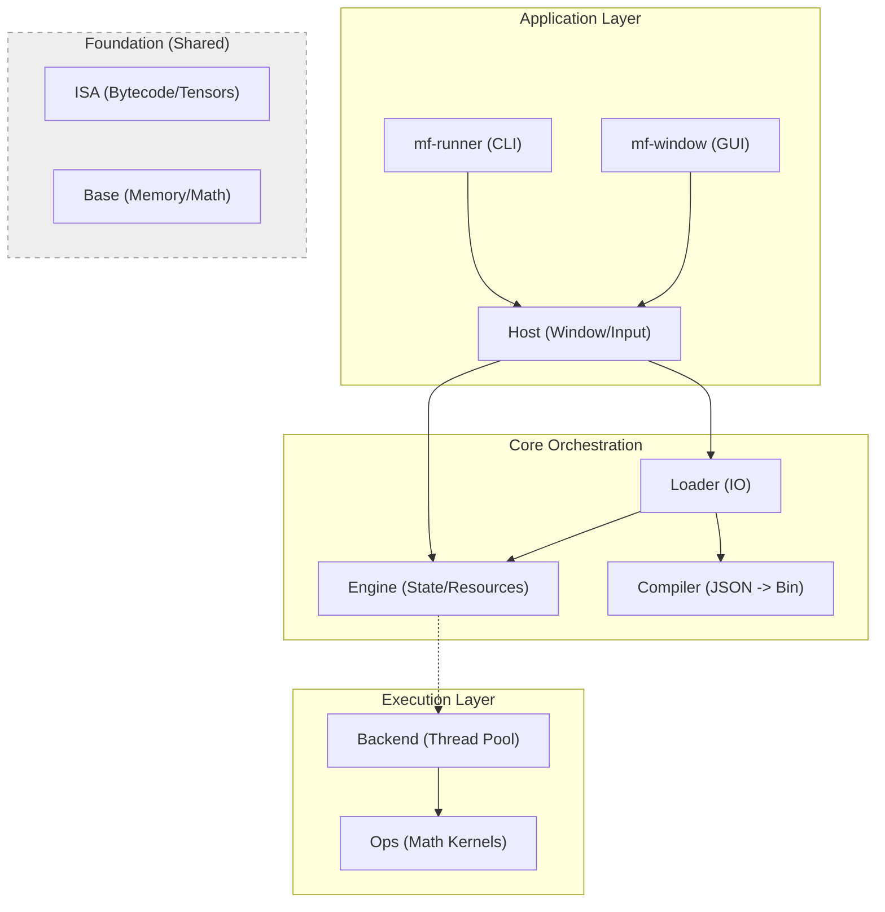

# MathFlow Architecture

MathFlow is a **Data-Oriented Computation Engine**. It is designed to process data streams (Tensors) efficiently by strictly separating the **definition** of logic from its **execution**.

## System Overview

The system is built as a layered hierarchy of modules. Lower layers (Base, ISA) have no dependencies on upper layers.



---

## Module Responsibilities

### 1. Foundation Layers

#### **Base** (`modules/base`)
*   **Role:** The bedrock. Zero external dependencies.
*   **Contents:**
    *   `mf_types.h`: Core typedefs (`f32`, `u8`, `mf_type_info`).
    *   `mf_memory`: Dual-allocator system (Stack Arena + Heap).
    *   `mf_buffer`: Raw memory container (owns `void* data`).
    *   `mf_math`: Basic scalar math functions.
    *   `mf_log`: Logging subsystem.

#### **ISA** (`modules/isa`)
*   **Role:** The "Contract" or Interface. Defines the data structures used to communicate between modules. Pure data, no logic.
*   **Contents:**
    *   `mf_program`: The compiled bytecode format.
    *   `mf_instruction`: Opcode definitions (`MF_OP_ADD`, `MF_OP_SELECT`). Supports up to 3 source operands (Ternary Ops).
    *   `mf_tensor`: **The View**. A lightweight struct (`info`, `buffer*`, `offset`) that points to data. Does *not* own memory.
    *   `mf_state`: Holds registers (tensors) for a running program.

#### **Ops** (`modules/ops`)
*   **Role:** The "Standard Library" of math functions.
*   **Contents:**
    *   Stateless functions implementing the instructions (`op_add`, `op_matmul`).
    *   Handles shape resolution logic (broadcasting).
    *   **Crucial:** Operations are agnostic to where data lives (CPU/GPU).

### 2. Compilation & Loading

#### **Compiler** (`modules/compiler`)
*   **Role:** Translates human-readable Graphs (JSON) into machine-efficient Bytecode (`mf_program`).
*   **Architecture:** Modular Pipeline of independent passes.
*   **Process:**
    1.  **Parse:** JSON -> `mf_ast`. Includes source tracking (line/column) for error reporting.
    2.  **Lower:** AST -> `mf_graph_ir`. Maps named ports to numeric indices and resolves constants.
    3.  **Inline:** Recursively expands `Call` nodes, embedding subgraphs into the flat IR.
    4.  **Analyze:** Static analysis pass. Performs type checking and shape inference (including wildcard `0` broadcasting for dynamic shapes).
    5.  **CodeGen:** Topologically sorts the graph and emits `mf_instruction` bytecode.

#### **Loader** (`modules/loader`)
*   **Role:** IO Bridge.
*   **Function:** Reads files from disk, calls the Compiler, and hydrates the Engine with the resulting Programs.
*   **Optimization:** Names are converted to FNV-1a hashes during loading for `O(1)` resource binding.

### 3. Runtime Core

#### **Backend** (`modules/backend_cpu`)
*   **Role:** The "Muscle". Executes the bytecode.
*   **Logic:**
    *   **Windowed Execution:** Splits large tasks (e.g., 4K image) into small linear jobs (e.g., 4096 elements).
    *   **Zero-Copy Views:** Workers execute directly on global buffers by creating "Tensor Views" with byte offsets.
    *   **Thread Pool:** Distributes jobs across CPU cores.

#### **Engine** (`modules/engine`)
*   **Role:** The "Brain" / Orchestrator.
*   **Responsibilities:**
    *   **Resource Management:** Allocates Global Buffers (the physical memory).
    *   **Pipeline Management:** Coordinates multiple Kernels (Physics, Render).
    *   **State Machine:** Manages Double Buffering (Front/Back) for temporal consistency.
    *   **Dispatch:** Binds Resources to Kernels and commands the Backend to execute.

### 4. Application Layer

#### **Host** (`modules/host`)
*   **Role:** The shell.
*   **Implementations:**
    *   `mf_host_headless`: For CLI/Testing.
    *   `mf_host_sdl`: For Visual output (Window, Input handling).
*   **Manifest:** Loads `.mfapp` files to configure the window and pipeline.

---

## The Pipeline Model

MathFlow orchestrates execution via a **Pipeline**, moving away from a monolithic script to a system of interacting kernels.

1.  **Kernel:** A single compiled Graph (Program). It is stateless and pure ($Y = F(X)$).
2.  **Resource:** A named Global Buffer (e.g., `out_Color`, `Physics.Pos`). Persists across frames.
3.  **Binding:** Explicit link between a Kernel Port and a Global Resource.
    *   *Zero-Copy:* The Kernel's input/output tensor is a View into the Global Resource's buffer.
4.  **Scheduler:** The Engine executes Kernels sequentially.
    *   **Double Buffering:** Resources automatically swap Front/Back buffers each frame to ensure thread safety and temporal consistency.

---

## Memory Model (Phase 22)

MathFlow distinguishes between **Storage** and **View**.

1.  **mf_buffer (Storage):**
    *   A raw allocation of bytes.
    *   Owned by `mf_engine` (for global resources) or `mf_state` (for temp data).
    *   Heavyweight (allocation/free).

2.  **mf_tensor (View):**
    *   Metadata (`shape`, `dtype`, `strides`) + Pointer to Buffer + Offset.
    *   Lightweight (created on stack/arena).
    *   **Zero-Copy Ops:** `Slice`, `Reshape`, and `Transpose` creates a new *View* without touching the *Buffer*.

3.  **Execution:**
    *   The Engine allocates **A** and **B** buffers for every global resource.
    *   On Frame N: Inputs read from **A**, Outputs write to **B**.
    *   On Frame N+1: Swap A/B.
    *   The Backend creates temporary Views into these buffers for each worker thread.

---

## Data Flow

1.  **Load:** Host loads `app.mfapp`. Loader parses JSON, compiles Graphs into `mf_program`.
2.  **Bind:** Engine allocates Global Resources (`mf_buffer`) and links them to Kernel Ports.
3.  **Loop:**
    *   Host updates Input Resources (Mouse, Time).
    *   Engine determines active buffers (A/B).
    *   **Dispatch:** Backend splits domain into jobs.
    *   **Execute:** Workers compute math, writing directly to Output Buffers (via Views).
    *   Host reads Output Resource (`out_Color`) and renders to screen.

## Pipeline Manifest (.mfapp)

The `.mfapp` file is the entry point for applications. It defines the window settings and the computation pipeline.

**Schema (Strict Arrays):**

```json
{
    "window": {
        "title": "My App",
        "width": 800,
        "height": 600
    },
    "pipeline": {
        "resources": [
            { "name": "State", "dtype": "F32", "shape": [1024] },
            { "name": "Screen", "dtype": "F32", "shape": [800, 600, 4] }
        ],
        "kernels": [
            {
                "id": "logic",
                "entry": "logic.json",
                "bindings": [
                    { "port": "State", "resource": "State" }
                ]
            },
            {
                "id": "render",
                "entry": "render.json",
                "bindings": [
                    { "port": "Data", "resource": "State" },
                    { "port": "Out",  "resource": "Screen" }
                ]
            }
        ]
    }
}
```

## Random Access & Domain Iteration

### Domain Iteration
The Backend determines the "Execution Domain" based on the shape of the bound **Output Tensor(s)**.
*   If Output is `[800, 600, 4]`, the kernel executes `800 * 600 * 4` times (conceptually).
*   **`Index` Nodes:** To know "where" the current thread is running (e.g., pixel coordinate), the graph must use `Index` nodes (`u_FragX`, `u_FragY`). These read from the thread context.

### Random Access (Gather)
Standard operations (Add, Mul) operate on streams linearly. To implement logic like "Read the value at index `i`", MathFlow uses `MF_OP_GATHER`.

*   **Logic:** `Output[i] = Source[ Indices[i] ]`
*   **Usage:** Used for looking up state, texture sampling (future), or indirect addressing.
*   **Input:** Requires a `Data` tensor and an `Indices` tensor. The Output shape follows the `Indices` shape.
