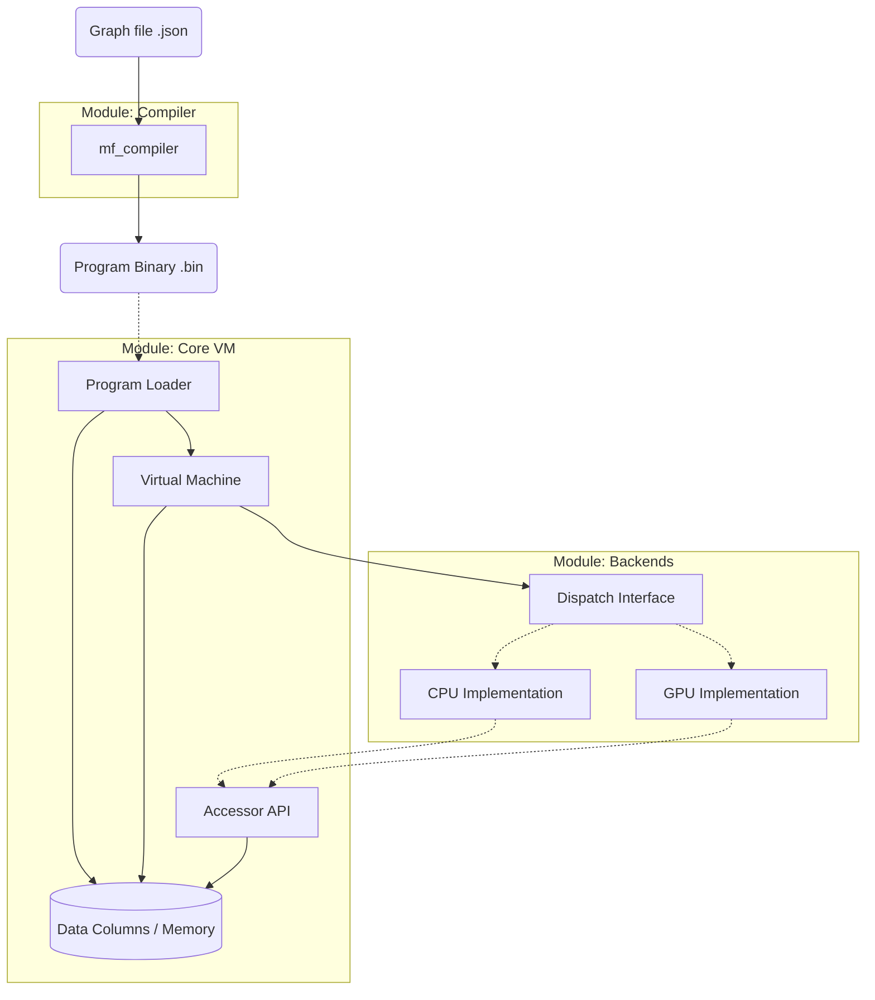

# MathFlow Architecture

MathFlow is a high-performance, modular data processing engine designed around Data-Oriented Design principles. It separates the definition of computation (Graph/Bytecode) from its execution (Backend).

## 1. System Overview

The project is structured as a **Monorepo** containing several decoupled modules.

---

## 2. Modules

### 2.1. ISA (`modules/isa`)
*   **Role:** The "Contract". Defines the Instruction Set Architecture.
*   **Content:** Header-only definitions of Opcodes (`MF_OP_ADD`), Instruction Formats, and Basic Types.
*   **Dependencies:** None.

### 2.2. Virtual Machine (`modules/vm`)
*   **Role:** The Orchestrator & Memory Owner.
*   **Responsibility:**
    *   **Loader:** Reads `mf_program` asset.
    *   **Memory Management:** Owns `mf_column` structures (encapsulated). Provides **Accessor API** (`mf_vm_map_*`) for safe access.
    *   **Init:** Copies initial constants (data section) into memory columns.
    *   **Execution Strategy:** Delegates execution to a Backend via `mf_backend_dispatch_table`.
*   **Dependencies:** `isa`.

### 2.3. Compiler (`modules/compiler`)
*   **Role:** The Translator (Offline Tool).
*   **Responsibility:**
    *   Parses human-readable JSON graphs.
    *   Performs Topological Sorting (Dependency Resolution).
    *   Allocates Registers (Indices).
    *   **Output:** Generates a self-contained `mf_program` (Bytecode + Data Section). Does NOT interact with VM memory directly.
*   **Dependencies:** `isa`, `cJSON`.

### 2.4. Backend: CPU (`modules/backend_cpu`)
*   **Role:** Reference Implementation.
*   **Responsibility:** Provides C11 implementations for all mathematical operations defined in the ISA.
*   **Abstraction:** Uses `mf_ref_*` types and `mf_vm_map_*` accessors. Does NOT depend on internal memory layout.
*   **Mode:** Immediate Execution (Interpreter).

---

## 3. Memory Model & Synchronization

MathFlow uses an **Abstracted Columnar Memory Model**. The actual location of data (RAM, VRAM, Mapped Buffer) is hidden from the Backend and the User.

### 3.1. Accessor API
Instead of raw pointers, the system uses **Reference Views** (`mf_ref_f32`, `mf_ref_vec3`).
*   **Safety:** Implicit bounds checking in debug mode.
*   **Portability:** The underlying pointer (`ref.p`) can point to heap, stack, or memory-mapped file.

### 3.2. Backend Synchronization (Planned)
The VM acts as a mediator between the User and the Device (GPU).
*   **Hooks:** When `mf_vm_map_*` is called, the active Backend is notified.
*   **Lazy Sync:** The Backend can trigger a transfer (CPU <-> GPU) only when data is actually accessed.
*   **Transparency:** The application code remains agnostic to whether data is in RAM or VRAM.

---

## 4. Data Flow & I/O

MathFlow uses a **Declarative I/O Model**. The VM does not perform side effects (drawing, audio, networking) during execution. Instead, it transforms input data into output data.

### 4.1. Input
External systems (Physics Engine, UI, Network) write raw data directly into the **Input Columns** of the VM via the Accessor API before execution begins.

### 4.2. Execution
The VM runs the graph. The Backend reads Input Columns and populates Intermediate/Output Columns using the Dispatch Interface.

### 4.3. Output
After execution finishes, the external system reads the **Output Columns**.
*   **Visualizer:** Reads `Pos` and `Color` columns to render instances.
*   **Game Logic:** Reads `Health` or `Velocity` columns to update game state.

This "Batch Processing" approach ensures maximum cache locality on CPU and efficient bus transfer for GPU.
