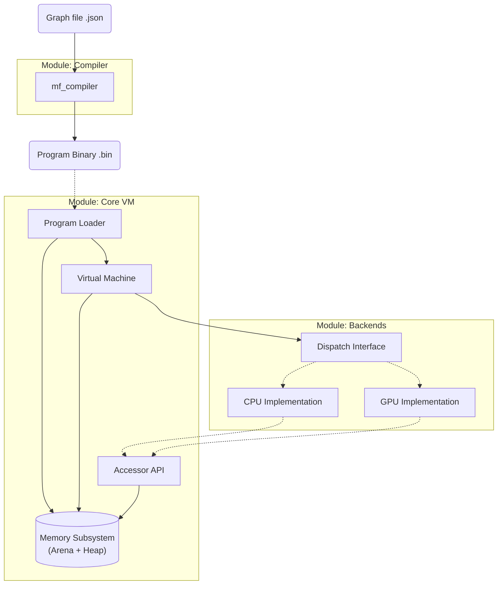

# MathFlow Architecture

MathFlow is a high-performance, modular data processing engine designed around Data-Oriented Design principles. It separates the definition of computation (Graph/Bytecode) from its execution (Backend).

## 1. System Overview

The project is structured as a **Monorepo** containing several decoupled modules.

---

## 2. Modules

### 2.1. ISA (`modules/isa`)
*   **Role:** The "Contract". Defines the Instruction Set Architecture.
*   **Content:** Header-only definitions of Opcodes (`MF_OP_ADD`), Instruction Formats (`mf_instruction`), and Basic Types (`mf_tensor`).
*   **Dependencies:** None.

### 2.2. Virtual Machine (`modules/vm`)
*   **Role:** The Orchestrator & Memory Owner.
*   **Responsibility:**
    *   **Loader:** Reads `mf_program` asset.
    *   **Memory Management:** Manages dual-allocator system (Arena for static data, Heap for dynamic tensors).
    *   **Init:** Instantiates registers (tensors) from program descriptors.
    *   **Execution Strategy:** Delegates execution to a Backend via `mf_backend_dispatch_table`.
    *   **Dynamic Resizing:** Handles `mf_vm_resize_tensor` requests from backend to support variable workloads.
*   **Dependencies:** `isa`.

### 2.3. Compiler (`modules/compiler`)
*   **Role:** The Translator (Offline Tool).
*   **Responsibility:**
    *   Parses human-readable JSON graphs.
    *   Performs Topological Sorting (Dependency Resolution).
    *   Allocates Registers (Indices).
    *   Performs static Shape Inference where possible.
    *   **Output:** Generates a self-contained `mf_program` (Bytecode + Data Section). Does NOT interact with VM memory directly.
*   **Dependencies:** `isa`, `cJSON`.

### 2.4. Backend: CPU (`modules/backend_cpu`)
*   **Role:** Reference Implementation.
*   **Responsibility:** Provides C11 implementations for all mathematical operations defined in the ISA.
*   **Runtime Resolution:** Calculates output shapes based on input shapes (broadcasting) and requests VM to resize destination buffers.
*   **Abstraction:** Uses `mf_vm_map_tensor` to access data. Does NOT manage memory directly (no `malloc`).
*   **Mode:** Immediate Execution (Interpreter).

---

## 3. Memory Model

MathFlow uses a **Unified Tensor Memory Model** backed by a custom allocator system. This ensures predictable memory usage and avoids system `malloc` calls during the "Hot Loop".

### 3.1. Dual-Allocator System
The VM distinguishes between two types of memory:
1.  **Arena (Static/Frame):** Used for the Program structure, Instruction buffer, and Tensor Metadata. Fast linear allocation, reset at the end of lifecycle.
2.  **Heap (Dynamic):** A custom Free-List allocator used for Tensor Data buffers. Supports `realloc` and `free`. Crucial for handling dynamic batch sizes (e.g., varying number of particles or entities per frame).

### 3.2. Dynamic Tensors
Tensors in MathFlow are dynamic containers.
*   **Capacity:** Tensors track their allocated size (`capacity_bytes`).
*   **Resize:** If an operation requires a larger output buffer (e.g., broadcasting a scalar to a vector), the VM reallocates the buffer via the Heap allocator.
*   **Zero-Copy Views:** (Planned) Future support for tensors that point to external memory without ownership.

### 3.3. Backend Synchronization (Planned)
The VM acts as a mediator between the User and the Device (GPU).
*   **Hooks:** When `mf_vm_map_*` is called, the active Backend is notified.
*   **Lazy Sync:** The Backend can trigger a transfer (CPU <-> GPU) only when data is actually accessed.

---

## 4. Data Flow & I/O

MathFlow uses a **Declarative I/O Model**. The VM does not perform side effects (drawing, audio, networking) during execution. Instead, it transforms input data into output data.

### 4.1. Input
External systems (Physics Engine, UI, Network) write raw data directly into the **Input Tensors** of the VM via the Accessor API before execution begins. If data size changes (e.g., more enemies spawned), the external system triggers a resize.

### 4.2. Execution
The VM runs the graph. The Backend reads Input Tensors and populates Intermediate/Output Tensors using the Dispatch Interface. Shape resolution happens just-in-time.

### 4.3. Output
After execution finishes, the external system reads the **Output Tensors**.
*   **Visualizer:** Reads `Pos` and `Color` tensors to render instances.
*   **Game Logic:** Reads `Health` or `Velocity` tensors to update game state.