# MathFlow Architecture

MathFlow is a high-performance, **Data-Oriented** computation engine. It treats everything — from physics to UI layout — as mathematical operations on arrays (tensors).

> **Core Philosophy:** "The Graph is a Shader."
> Whether running on CPU (Interpreter) or GPU (Transpiled), the logic is pure math. The Host Application provides the Canvas and Inputs; the Graph calculates the State and Pixels.

## 1. System Overview

**How it works:** You write a graph (JSON). The Engine compiles it, loads it into memory, and the VM executes it frame-by-frame using high-performance math kernels.

```mermaid
flowchart LR
    %% Styles
    classDef file fill:#fff,stroke:#333,stroke-width:1px,stroke-dasharray: 5 5;
    classDef proc fill:#eef,stroke:#33a,stroke-width:2px;
    classDef memory fill:#fee,stroke:#a33,stroke-width:2px;
    classDef hw fill:#efe,stroke:#3a3,stroke-width:2px;

    %% Data
    User((User))
    Source["📄 Graph (.json)"]:::file
    Binary[("💾 Program (.bin)")]:::memory

    %% Compilation
    subgraph Build ["Phase: Build & Load"]
        direction TB
        Compiler["⚙️ Compiler"]:::proc
    end

    %% Execution
    subgraph Run ["Phase: Execution Loop"]
        direction TB
        Engine["🚂 Engine"]:::proc
        VM[["🧠 VM (State)"]]:::proc
        Backend["🔌 Backend"]:::hw
        Ops["💪 Math Kernels"]:::hw
    end

    Input["🖱️ Input"]:::hw
    Screen["🖥️ Screen"]:::hw

    %% Flow
    User -- "Edits" --> Source
    Source -- "Parses" --> Compiler
    Compiler -- "Generates" --> Binary
    
    Binary -- "Loads into" --> Engine
    Engine -- "Starts" --> VM
    
    %% The Interactive Loop
    Input -- "Events" --> VM
    VM -- "Dispatches" --> Backend
    Backend -- "Calls" --> Ops
    Ops -. "Updates Memory" .-> VM
    VM -- "Pixels" --> Screen
```



---

## 2. Modules

The codebase is organized in layers. High-level apps sit on top, orchestrating the Engine, which relies on the Core Logic, backed by the Low-Level Foundation.

```mermaid
graph TD
    %% Styles
    classDef layerApp fill:#dce,stroke:#86b,stroke-width:2px;
    classDef layerHost fill:#cde,stroke:#68b,stroke-width:2px;
    classDef layerCore fill:#dec,stroke:#6b8,stroke-width:2px;
    classDef layerBase fill:#edd,stroke:#b66,stroke-width:2px;

    %% Layer 1: Apps
    subgraph L1 ["Layer 1: The User Experience"]
        App_GUI["🖼️ mf-window"]:::layerApp
        App_CLI["⌨️ mf-runner"]:::layerApp
    end

    %% Layer 2: Host
    subgraph L2 ["Layer 2: Host Framework"]
        HostCore["📜 Host Core (Config)"]:::layerHost
        HostCLI["⌨️ Host CLI (Headless)"]:::layerHost
        HostSDL["🔌 Host SDL (Window)"]:::layerHost
    end

    %% Layer 3: Core
    subgraph L3 ["Layer 3: System Core"]
        Engine["🚂 Engine (Resources)"]:::layerCore
        VM["🧠 Virtual Machine"]:::layerCore
        Compiler["⚙️ Compiler"]:::layerCore
    end

    %% Layer 4: Compute
    subgraph L4 ["Layer 4: Compute Providers"]
        Backend["🔌 Backend Interface"]:::layerBase
        Ops["💪 Math Kernels"]:::layerBase
    end

    %% Layer 5: Foundation
    subgraph L5 ["Layer 5: Project Foundation"]
        Base["🧱 Base (Mem/Threads)"]:::layerBase
        ISA["📜 ISA (The Contract)"]:::layerBase
    end

    %% Dependencies (Control Flow)
    App_GUI --> HostSDL
    App_CLI --> HostCLI
    
    HostSDL --> HostCore
    HostSDL --> Engine
    
    HostCLI --> HostCore
    HostCLI --> Engine
    
    Engine --> VM
    Engine --> Compiler
    
    %% Core drives Compute
    VM --> Backend
    Backend --> Ops
    
    %% Key dependencies on Foundation
    Compiler -.-> ISA
    VM -.-> ISA
    Ops -.-> Base
```



### 2.0. Engine (`modules/engine`)
*   **Role:** The "Owner". Unified Resource Manager.
*   **Responsibility:**
    *   Manages the **Static Lifecycle**: Loads graphs/binaries, allocates the Arena (Program memory).
    *   **Instance Factory:** Provides API (`mf_engine_create_instance`) to create execution instances (`mf_instance`) which bundle a VM with its own Heap memory.
    *   Acts as the central API for initializing the library, independent of the execution strategy.

### 2.1. ISA (`modules/isa`)
*   **Role:** The "Contract". Defines the Instruction Set Architecture.
*   **Content:** Header-only definitions of Opcodes (`MF_OP_ADD`, `MF_OP_COPY`), Instruction Formats, and Binary Header structures.
*   **Versioning:** Includes a versioned binary format to ensure backward compatibility.

### 2.2. Virtual Machine (`modules/vm`)
*   **Role:** The "Runner". Executes logic sequentially or in parallel.
*   **Concept:** Acts as the central execution engine.
*   **Key Responsibilities:**
    *   **Execution State:** Manages the Heap (Variables) globally for the instance.
    *   **Parallelism:** Can execute bytecode over a domain (e.g., pixels) using a thread pool from `base`.
    *   **Use Case:** Everything from simple game logic to complex parallel rendering.
    *   **Symbol Table Access:** Uses the Engine's context to map names to registers.

### 2.4. Platform (`modules/base`)
*   **Role:** OS Abstraction Layer.
*   **Content:** Unified API for Threads, Mutexes, Condition Variables, Atomics, and Thread Pool. Supports Windows (Win32) and Linux (pthreads).

### 2.5. Host (`modules/host`)
*   **Role:** Application Framework.
*   **Structure:** Split into three components:
    *   **`Host Core` (`mf_host_core`):** Pure logic for parsing Application Manifests (`.mfapp`) and configuration (`mf_host_desc`). No dependencies on graphics libraries.
    *   **`Host CLI` (Planned):** Headless runtime for executing graphs without a window. Used by CLI tools.
    *   **`Host SDL` (`mf_host_sdl`):** Implements the platform backend using SDL2 (Window creation, Input, Event Loop). Used by GUI apps.
    *   **Implementation:** See `mf_manifest_loader.h` and `mf_host_sdl.h`.

### 2.6. Backend: CPU (`modules/backend_cpu`)
*   **Role:** Reference Implementation (Software Renderer).
*   **Responsibility:** Initializes the Dispatch Table with CPU implementations.
*   **Capabilities:** Supports dynamic broadcasting and reshaping.

### 2.7. Operations Libraries (`modules/ops_*`)
These modules contain the actual mathematical kernels.
*   **`modules/ops_core`:** Basic arithmetic, Trigonometry, Logic, Matrix ops, and State Relay.
*   **`modules/ops_array`:** Array manipulation kernels.

---

## 3. Sub-Graphs (Modularity)

MathFlow supports modularity through a "Call-by-Inlining" mechanism. This allows creating complex logic from simple, reusable primitives.

### 3.1. The "Call" Node
A `Call` node references another `.json` file. During compilation, the parser:
1.  Loads the target graph.
2.  **Prefixing:** Adds the caller node's ID as a prefix to all internal nodes (e.g., `button_1::circle::sdf`) to ensure unique names.
3.  **Interface Mapping:**
    *   `ExportInput`: Maps parent `links` (by port index) to internal sub-graph entry points.
    *   `ExportOutput`: Maps internal results back to parent ports.
4.  **Flattening:** Merges the expanded node list into the main graph IR.

### 3.2. Relative Path Resolution
The compiler supports relative paths within sub-graphs. If `A.json` calls `B.json` and `B.json` calls `C.json`, the path to `C` is resolved relative to the location of `B`.

---

## 4. The Standard Protocol (Shader Mode)

MathFlow is evolving into a system capable of rendering UI purely through mathematics (SDFs, Pixel Math), similar to a Fragment Shader. This section describes the standard interface used in **Shader Mode**.

### 4.1. I/O Protocol (Symbol Table)
The Host Application interacts with the VM using Named Registers:
1.  **Host Initialization:** `time_reg = mf_vm_find_register(vm, "u_Time")`.
2.  **Per-Frame:** Write value to `time_reg`.
3.  **Execution:** `mf_vm_exec(vm)` (or `mf_vm_exec_parallel` for tiled rendering).
4.  **Readback:** Read from `mf_vm_find_register(vm, "out_Color")`.

### 4.2. State Management
To support interactive UI (toggles, animations) without external logic:
*   **`MF_NODE_MEMORY`:** Acts as a "delay" line. Outputs the value from the *previous* frame.
*   **Cycle Breaking:** The compiler treats Memory nodes as inputs (Roots) for the current frame to resolve dependency cycles.
*   **`MF_OP_COPY`:** At the end of the frame, the VM executes hidden copy instructions to update Memory nodes.

---

## 5. Memory Model

### 5.1. Dual-Allocator Strategy
1.  **Arena (Static - Engine Owned):** Stores the Program Code, Constants, Symbol Table, and Tensor Metadata. Allocated once at startup.
2.  **Heap (Dynamic - VM Owned):** Stores Tensor Data (Variables). Supports `realloc` for dynamic resizing (e.g., resolution change).

### 5.2. Tensor Ownership
*   **Constants:** Stored in the Program Binary (Arena).
*   **Variables:** Allocated in the VM Heap.
*   **View (Planned):** Support for referencing external memory (e.g., direct write to SDL Surface or GPU Buffer).

---

## 6. The Application Layer (Phase 14)

MathFlow separates **Logic Definition** (Graphs) from **Application Configuration** (Manifests). The Host Application (`mf_host`) acts as a generic runtime that is configured by data.

### 6.1. Manifest (`.mfapp`)
A JSON file that defines *how* to run a graph.
```json
{
    "runtime": {
        "type": "shader",           // Execution Strategy
        "entry": "../graphs/ui.json" // Relative path to logic
    },
    "window": {
        "title": "My UI",
        "width": 800,
        "height": 600,
        "vsync": true
    }
}
```

### 6.2. Execution Modes
The Manifest dictates the runtime strategy:

1.  **Shader Mode (`MF_HOST_RUNTIME_SHADER`):**
    *   **Goal:** Visuals, UI, Image Processing.
    *   **Architecture:** Parallel VM execution over a thread pool.
    *   **Behavior:** The screen is split into tiles. The Graph is executed in parallel for every pixel/tile.
    *   **State:** Generally stateless per frame (like a Fragment Shader), though `Memory` nodes allow inter-frame persistence (simulated via double-buffering).
    *   **Host Logic:** Renders to a texture at 60 FPS.

2.  **Script Mode (`MF_HOST_RUNTIME_SCRIPT`):**
    *   **Goal:** Game Logic, Data Processing, CLI Tools.
    *   **Architecture:** Single-threaded, Stateful.
    *   **Behavior:** The Graph runs once per "tick". State persists naturally in the VM Heap.
    *   **Host Logic:** Runs the loop and prints debug output (`out_Color`) to the console.
