# MathFlow Architecture

MathFlow is a high-performance, **Data-Oriented** computation engine. It treats everything — from physics to UI layout — as mathematical operations on arrays (tensors).

> **Core Philosophy:** "The Graph is a Kernel."
> The Engine orchestrates a **Pipeline** of interacting kernels, managing Time and State via Double-Buffering.

## 1. System Overview

**Architecture:** Pipeline of Kernels acting on Global State.

The **Engine** owns the **Global Resources** (Memory).
The **Pipeline** defines how **Kernels** (Programs) read from and write to these resources.

```mermaid
sequenceDiagram
    participant Host as 🖥️ Host App
    participant Engine as ⚙️ Engine
    participant Kernels as 🧩 Pipeline (Kernels)
    participant Memory as 💾 Global State

    Note over Host, Memory: 1. Preparation
    Host->>Memory: Write Inputs (Mouse, Time)
    
    Note over Host, Memory: 2. Execution
    Host->>Engine: mf_engine_dispatch()
    
    loop For Each Kernel
        Engine->>Kernels: Bind Resources (Front->Read, Back->Write)
        Kernels->>Memory: Compute (Read A, Write B)
    end
    
    Note over Engine: 3. Finalize
    Engine->>Engine: Increment Frame Index (Virtual Swap)
    
    Note over Host, Memory: 4. Presentation
    Host->>Memory: Read Output (Back Buffer)
```



---

## 2. Core Concepts

### 2.1. The Engine (Orchestrator)
The `mf_engine` is the Lifecycle Manager.
*   **Role:** Single Source of Truth.
*   **Responsibility:**
    *   Allocates Global Resources (Double Buffered).
    *   Loads Kernels (Programs).
    *   Manages the Frame Index and Buffer Swapping.
    *   Dispatches execution based on **Output-Driven** logic.

### 2.2. Global Resources (The Blackboard)
Data is stored in named, typed buffers (e.g., `pos`, `vel`, `out_Color`).
*   **Double Buffering:** Every resource has two buffers: `A` (Front) and `B` (Back).
*   **Ping-Pong:**
    *   **Frame N (Even):** Kernels read from `A`, write to `B`.
    *   **Frame N+1 (Odd):** Kernels read from `B`, write to `A`.
*   **Statelessness:** This ensures determinism and thread safety.

### 2.3. Kernels (The Logic)
A Kernel is a compiled Graph (`mf_program`) bound to the Global Resources.
*   **Execution Domain:** Defined automatically by the size of the bound **Output Resource**.
    *   *Physics Kernel* writes to `pos` (size 1000) -> Runs 1000 threads.
    *   *Render Kernel* writes to `out_Color` (size 1920x1080) -> Runs 2M threads.
*   **Bindings:** Map local symbols (e.g., `in_Pos`) to global resources (e.g., `Physics.Position`).

### 2.4. The Backend (Executor)
The strategy for running the code.
*   **CPU Backend:** Tiled Interpreter. Splits the domain into chunks and processes them in parallel threads.
*   **GPU Backend (Future):** JIT-compiles kernels to shaders.

---

## 3. Execution Flow (The Lifecycle)

1.  **Setup (Bind Pipeline):**
    *   Host loads `.mfapp` (Manifest).
    *   Engine allocates `mf_resource_inst` (Buffers A & B).
    *   Engine loads `mf_program` and resolves Bindings.
    *   Engine identifies the **Master Binding** (Output) for each kernel.

2.  **Input:**
    *   Host maps `INPUT` resources (e.g., `u_Mouse`, `u_Time`) and writes data to the *Front Buffer*.

3.  **Dispatch (Frame Start):**
    *   **Call:** `mf_engine_dispatch(engine)`.
    *   **Loop:** For each Kernel in the pipeline:
        1.  **Resolve Domain:** Look up the Master Output Resource. Its size defines the Loop Count.
        2.  **Bind Memory:** 
            *   Map `INPUT` symbols -> Front Buffer (Read-Only).
            *   Map `OUTPUT` symbols -> Back Buffer (Write-Only).
        3.  **Execute:** Backend runs the kernel in parallel.

4.  **Frame End:**
    *   Engine increments `frame_index`.
    *   Effectively swaps Front/Back pointers for the next frame.

---

## 4. Modules Detail

*   `modules/isa`: **The Contract**. Defines `mf_program` (Bytecode) and `mf_tensor` (Data Layout).
*   `modules/compiler`: **The Translator**. Converts JSON graphs to Bytecode. Implements **Hybrid Parsing** (Supports `shape`/`dtype` schema).
*   `modules/engine`: **The Core**. Pipeline management, Resource allocation, Dispatch logic.
*   `modules/backend_cpu`: **The Worker**. Thread pool and Tiled Interpreter.
*   `modules/host`: **The Application**. SDL2 windowing, Input handling, Asset loading.

## 5. JSON Schema (Graph Definition)

MathFlow graphs use a strict schema for I/O to enable AOT validation.

**Input Node:**
```json
{
  "id": "u_Time",
  "type": "Input",
  "data": {
    "shape": [],       // Empty = Scalar
    "dtype": "f32"     // "f32", "i32", "bool"
  }
}
```

**Output Node:**
```json
{
  "id": "final_result",
  "type": "Output" 
  // Size is inherited from the connected link
}
```

**Const Node:**
```json
{
  "id": "gravity",
  "type": "Const",
  "data": {
    "value": -9.8  // Value is baked into the program
  }
}
```