# MathFlow Architecture

MathFlow is a high-performance, **Data-Oriented** computation engine. It treats everything — from physics to UI layout — as mathematical operations on arrays (tensors).

> **Core Philosophy:** "The Graph is a Shader."
> Whether running on CPU (Interpreter) or GPU (Transpiled), the logic is pure math. The Host Application provides the Canvas and Inputs; the Graph calculates the State and Pixels.

## 1. System Overview

**Architecture:** Single State Engine.
The Engine owns the Code (Arena) and the Data (Heap). Execution is unified under a single `dispatch` API. The Engine acts as the **Source of Truth**, and parallel workers are transient consumers of this state.

```mermaid
flowchart LR
    %% Styles
    classDef file fill:#fff,stroke:#333,stroke-width:1px,stroke-dasharray: 5 5;
    classDef proc fill:#eef,stroke:#33a,stroke-width:2px;
    classDef memory fill:#fee,stroke:#a33,stroke-width:2px;
    classDef hw fill:#efe,stroke:#3a3,stroke-width:2px;

    %% Data
    User((User))
    Source["📄 Graph (.json)"]:::file
    Binary[("💾 Program (.bin)")]:::memory

    %% Compilation
    subgraph Build ["Phase: Host / Build"]
        direction TB
        Loader["📂 Asset Loader"]:::proc
        Compiler["⚙️ Compiler"]:::proc
    end

    %% Execution
    subgraph Run ["Phase: Engine Execution"]
        direction TB
        Engine["🚂 Engine (Source of Truth)"]:::proc
        VM_Main["🧠 Main VM"]:::memory
        Backend["🔌 Backend (CPU/GPU)"]:::hw
        Pool["🧵 Workers"]:::proc
    end

    Input["🖱️ Input"]:::hw
    Screen["🖥️ Screen"]:::hw

    %% Flow
    User -- "Edits" --> Source
    Source -- "Loads" --> Loader
    Loader -- "Uses" --> Compiler
    Compiler -- "Generates" --> Binary
    Loader -- "Binds Program" --> Engine
    
    Input -- "Writes Uniforms" --> Engine
    Engine -- "Dispatches" --> Backend
    
    Backend -- "Propagates State" --> Pool
    Pool -- "Reads/Slices" --> VM_Main
    Pool -- "Executes" --> Ops["💪 Kernels"]
    
    Engine -- "Reads Result" --> Screen
```



---

## 2. Core Concepts

### 2.1. Single State Engine
The `mf_engine` is the "Computer". It creates and owns the entire runtime environment.
*   **Encapsulation:** It hides the internal VM and Heap behind an opaque handle.
*   **Single Source of Truth:** All data (tensors) lives in the Engine's Heap. There are no separate "Instance" objects.

### 2.2. Unified Dispatch & State Propagation
MathFlow uses a smart dispatch system to handle both Logic (Script) and Graphics (Shader) workloads without explicit mode switching.

*   **Script Mode (Stateful):**
    *   **Call:** `mf_engine_dispatch(engine, 1, 1)`
    *   **Behavior:** Executes on the **Main VM** directly.
    *   **Use Case:** Game Logic, Physics, CLI Tools, One-shot calculations.

*   **Shader Mode (Stateless/Parallel):**
    *   **Call:** `mf_engine_dispatch(engine, Width, Height)`
    *   **Behavior:** Delegates to the **Backend**.
    *   **Propagation:** The Backend spins up worker VMs. These workers automatically **Copy** inputs (Uniforms) and **Slice** outputs (Buffers) from the Main VM.
    *   **Use Case:** Rendering, Image Processing, Particle Systems.

### 2.3. Memory Model
*   **Arena (Static):** Stores Program Code, Constants, Symbol Table. Allocated once at startup.
*   **Heap (Dynamic):** Stores Tensor Data (Variables). The main working memory.
    *   *Note:* Backend workers may use their own temporary memory (Arena/Heap) for intermediate calculations, but they read/write to the Main Engine's memory.

---

## 3. Modules Detail

The codebase is organized in layers, ensuring separation of concerns.

```mermaid
graph TD
    %% Styles
    classDef layerApp fill:#dce,stroke:#86b,stroke-width:2px;
    classDef layerHost fill:#cde,stroke:#68b,stroke-width:2px;
    classDef layerCore fill:#dec,stroke:#6b8,stroke-width:2px;
    classDef layerBase fill:#edd,stroke:#b66,stroke-width:2px;

    %% Layer 1: Apps
    subgraph L1 ["Layer 1: The User Experience"]
        App_GUI["🖼️ mf-window"]:::layerApp
        App_CLI["⌨️ mf-runner"]:::layerApp
    end

    %% Layer 2: Host
    subgraph L2 ["Layer 2: Host Framework"]
        HostHeadless["📜 Host Headless"]:::layerHost
        HostSDL["🔌 Host SDL (GUI)"]:::layerHost
        Loader["📂 Asset Loader"]:::layerHost
    end

    %% Layer 3: Core
    subgraph L3 ["Layer 3: System Core"]
        Engine["🚂 Engine (Runtime)"]:::layerCore
        VM["🧠 Virtual Machine"]:::layerCore
        Compiler["⚙️ Compiler"]:::layerCore
    end

    %% Layer 4: Compute
    subgraph L4 ["Layer 4: Compute Providers"]
        Backend["🔌 Backend (Thread Pool)"]:::layerBase
        Ops["💪 Math Kernels (ops)"]:::layerBase
    end

    %% Layer 5: Foundation
    subgraph L5 ["Layer 5: Foundation & Contracts"]
        Base["🧱 Base (Mem/Threads)"]:::layerBase
        ISA["📜 ISA (The Contract)"]:::layerBase
    end

    %% Dependencies
    App_GUI --> HostSDL
    App_CLI --> HostHeadless
    HostSDL --> Loader
    HostHeadless --> Loader
    HostSDL --> Engine
    HostHeadless --> Engine
    Loader --> Compiler
    Engine --> VM
    VM --> ISA
    Ops --> ISA
    Engine --> Backend
    Backend --> Ops
```



### 3.1. Engine (`modules/engine`)
The public face of the runtime.
*   **API:** `mf_engine_create`, `mf_engine_bind_program`, `mf_engine_dispatch`.
*   **Responsibility:** Lifecycle management, Resource ownership.
*   **Behavior:** Acts as the bridge between the Host (Data) and the Backend (Execution).

### 3.2. ISA (`modules/isa`)
The "Contract" defining the Instruction Set and Interfaces.
*   **Opcodes:** `MF_OP_ADD`, `MF_OP_COPY`, etc.
*   **Dispatch Table:** Defines the interface (`mf_backend_dispatch_table`) that backends must implement.

### 3.3. Virtual Machine (`modules/vm`)
The internal Bytecode Interpreter.
*   **Role:** Executes the program instructions sequentially. Pure execution logic, no I/O.
*   **Usage:** Used directly by the Engine for "Script Mode", and by the Backend for "Worker Threads".

### 3.4. Backend: CPU (`modules/backend_cpu`)
Reference implementation of parallel execution.
*   **Role:** Manages the Thread Pool and Worker VMs.
*   **State Propagation:** Handles the logic of copying Uniforms and tiling Output Tensors for each worker.

### 3.5. Host (`modules/host`)
Application Framework & Orchestration.
*   **`Asset Loader`:** Handles file I/O, format detection (.json vs .bin), and compilation.
*   **`Host SDL`:** SDL2 integration, Window management, Input handling.

---

## 4. The Standard Protocol (Host Integration)

This section describes how the Host interacts with the Engine.

### 4.1. I/O Protocol (Symbol Table)
The Host Application interacts with the VM using Named Registers (Uniforms):
1.  **Map:** `ptr = mf_engine_map_tensor(engine, "u_Time")`.
2.  **Write:** Update `*ptr` directly in memory (Zero-Copy).
3.  **Dispatch:** `mf_engine_dispatch(engine, 800, 600)`.
4.  **Read:** Read from `mf_engine_map_tensor(engine, "out_Color")`.

There are no per-job callbacks. The Engine ensures that the state written in step 2 is visible to all parallel workers in step 3.

### 4.2. State Management
To support interactive UI (toggles, animations) without external logic:
*   **`MF_NODE_MEMORY`:** Acts as a "delay" line. Outputs the value from the *previous* frame.
*   **Cycle Breaking:** The compiler treats Memory nodes as inputs (Roots) for the current frame to resolve dependency cycles.

---

## 5. Application Layer (Manifest)

MathFlow separates **Logic Definition** (Graphs) from **Application Configuration** (Manifests).

### 5.1. Manifest (`.mfapp`)
A JSON file that defines *how* to run a graph.
```json
{
    "runtime": {
        "entry": "../graphs/ui.json"
    },
    "window": {
        "title": "My UI",
        "width": 800,
        "height": 600,
        "vsync": true
    }
}
```