# MathFlow Architecture

MathFlow is a high-performance, **Data-Oriented** computation engine. It treats everything — from physics to UI layout — as mathematical operations on arrays (tensors).

> **Core Philosophy:** "The Graph is a Shader."
> The Engine manages Time and State. The Backend executes Logic over Space (Data).

## 1. System Overview

**Architecture:** Separated State & Execution.
The **Engine** owns the persistent Data (`mf_state`). The **Backend** creates ephemeral Execution Contexts (`mf_exec_ctx`) to process this data.

```mermaid
flowchart LR
    %% Styles
    classDef file fill:#fff,stroke:#333,stroke-width:1px,stroke-dasharray: 5 5;
    classDef proc fill:#eef,stroke:#33a,stroke-width:2px;
    classDef memory fill:#fee,stroke:#a33,stroke-width:2px;
    classDef hw fill:#efe,stroke:#3a3,stroke-width:2px;

    %% Data
    User((User))
    Source["📄 Graph (.json)"]:::file
    Program[("💾 Program (.bin)")]:::memory

    %% Compilation
    subgraph Build ["Phase: Host / Build"]
        direction TB
        Loader["📂 Asset Loader"]:::proc
        Compiler["⚙️ Compiler"]:::proc
    end

    %% Execution
    subgraph Run ["Phase: Engine Execution"]
        direction TB
        Engine["🚂 Engine (State & Logic)"]:::proc
        Backend["🔌 Backend (CPU/GPU)"]:::hw
        Ctx["⚡ Exec Context (View)"]:::proc
    end

    Input["🖱️ Input"]:::hw
    Screen["🖥️ Screen"]:::hw

    %% Flow
    User -- "Edits" --> Source
    Source -- "Loads" --> Loader
    Loader -- "Uses" --> Compiler
    Compiler -- "Generates" --> Program
    Loader -- "Binds" --> Engine
    
    Engine -- "Dispatches" --> Backend
    
    Backend -- "Creates" --> Ctx
    Ctx -.-> |Reads/Writes| Engine
    Ctx -- "Executes" --> Ops["💪 Kernels"]
    
    Input -- "Writes" --> Engine
    Engine -- "Reads" --> Screen
```

---

## 2. Core Concepts

### 2.1. The Engine (Owner)
The `mf_engine` is the Lifecycle Manager.
*   **Role:** Single Source of Truth.
*   **Responsibility:** Allocates memory (`mf_state`), manages Double Buffering (Ping-Pong) for time-dependent simulations, and orchestrates the Backend.

### 2.2. The State (Data)
`mf_state` is a passive container.
*   **Content:** Array of Tensor Descriptors (`registers`) and the Raw Memory Heap.
*   **Behavior:** It does not "run" anything. It just holds the bits.
*   **Storage:** Currently RAM (CPU), but designed to hold VRAM Handles in the future.

### 2.3. The Execution Context (View)
`mf_exec_ctx` is an ephemeral "Window" into the data.
*   **Role:** Adapts the global state for a specific kernel operation.
*   **Cardinality:** Many. One per thread / tile.
*   **Features:** Knows "Who am I?" (Thread ID, Tile Offset) and "Where is my data?" (Register Pointers).

### 2.4. The Backend (Executor)
The strategy for running the code.
*   **CPU Backend:** Creates N threads. Each thread creates a local `mf_exec_ctx` pointing to a tile of the screen, then runs the Interpreter Loop.
*   **GPU Backend (Future):** Compiles the graph to a shader and dispatches a compute job.

---

## 3. Modules Detail

### 3.1. Host (`modules/host`)
The Application Framework.
*   **Host SDL:** Manages the window, SDL2 renderer, and translates OS events to State updates (Mouse, Time).
*   **Manifest Loader:** Parses `.mfapp` files to automatically configure resolution and threads.

### 3.2. Loader (`modules/loader`)
The bridge between Files and the Engine.
*   Handles binary (`.bin`) and JSON (`.json`) graph loading.
*   Provides a convenient injection point for Backend initialization.

### 3.3. Engine (`modules/engine`)
The public API and Lifecycle Manager.
*   Owns the persistent `mf_state`.
*   Manages double-buffering and error aggregation.
*   `mf_engine_dispatch(engine, x, y)`: The primary tick function.

### 3.4. ISA (`modules/isa`)
The Contract. Defines data structures shared between all modules.
*   `mf_program`: The Bytecode and Static Metadata.
*   `mf_state`: The Persistent Data layout (and runtime error codes).
*   `mf_exec_ctx`: The Ephemeral Context definition.
*   `mf_backend`: The Abstract Interface for execution.

### 3.5. Ops (`modules/ops`)
The Math Kernel Library.
*   Pure C implementations of all opcodes.
*   Exposes `mf_ops_fill_table()` for CPU interpreters.

### 3.6. Backend: CPU (`modules/backend_cpu`)
The Reference Strategy.
*   Implements tiled parallel execution using a thread pool.
*   Contains the **Interpreter Loop** that executes ISA bytecode.

---

## 4. Execution Flow (The Lifecycle)

1.  **Setup:**
    *   Host creates `mf_engine`.
    *   Engine allocates `mf_state` (Heap).
    *   Engine binds `mf_backend_cpu`.

2.  **Input:**
    *   Host writes to `mf_state.registers["u_Mouse"]`.

3.  **Dispatch (Frame Start):**
    *   Engine calls `backend->dispatch(program, state, w, h)`.

4.  **Parallel Execution:**
    *   Backend splits domain (WxH) into Tiles.
    *   **Worker Thread:**
        *   Creates `mf_exec_ctx` on stack.
        *   Sets `ctx.offset` (Tile X, Y).
        *   Runs Loop: `for inst in code: op_table[inst.opcode](ctx, ...)`
        *   Opcode calls `mf_exec_ctx_map_tensor` -> Reads from `state` (or local cache).

5.  **Frame End:**
    *   Engine swaps Double Buffers (if Memory Nodes exist).
    *   Host reads from `mf_state.registers["out_Color"]`.

---

## 5. Future: GPU Strategy
The separation of State and Execution makes GPU integration natural.

*   `mf_state` will hold `cl_mem` or `VkBuffer` handles instead of `void*`.
*   `Backend GPU` will simply bind these handles to the Compute Shader.
*   The Interpreter Loop is bypassed entirely in favor of the GPU Hardware Scheduler.
