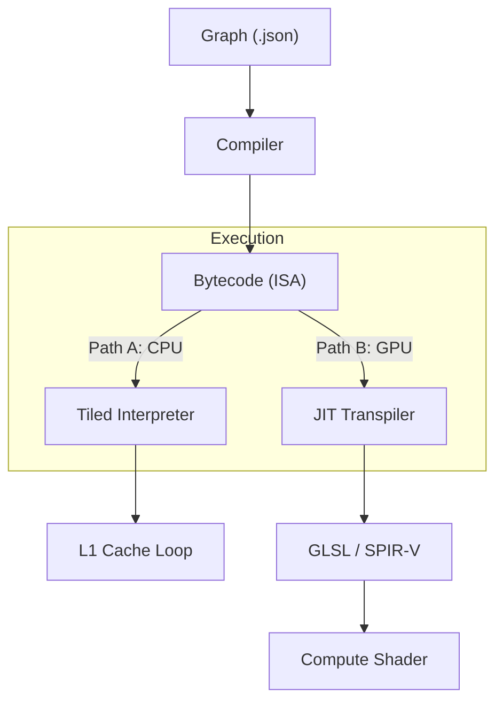

# MathFlow Future Architecture: The Path to GPU

> **Status:** Draft / Vision
> **Goal:** Document how the current CPU-based architecture evolves into a high-performance GPU engine without rewriting the core ISA.

## Core Philosophy: "One Bytecode, Dual Execution"

The central design decision is that `mf_program` (the Linear Bytecode) is the universal truth. It is not just instructions for a CPU interpreter; it is a platform-agnostic **Intermediate Representation (IR)**.

The Engine will support two execution paths based on the available hardware:



## 1. Path A: CPU (The Tiled Interpreter)
**Implemented in:** Phase 17 (Smart Tiling).

*   **Method:** Immediate Interpretation.
*   **Strategy:** **Tiled Execution**. The backend splits the domain (Screen) into small tiles (e.g., 64x64) to fit intermediate data into CPU L1/L2 Cache.
*   **Memory:** "Virtual Batching" ensures we never allocate full-frame buffers for intermediate steps.
*   **Pros:** Instant startup, simple debugging, works on any hardware.

## 2. Path B: GPU (The JIT Transpiler)
**Planned for:** Phase 20+.

*   **Method:** Ahead-of-Time (AOT) or Just-in-Time (JIT) Compilation.
*   **Strategy:** **Transpilation**. The backend reads the bytecode **once** and generates a textual or binary shader (GLSL/SPIR-V).
*   **Logic:**
    *   Instead of *executing* `OP_ADD`, the generator *writes* `vec4 r3 = r1 + r2;`.
    *   Registers (`r0`..`rN`) map directly to Shader Variables.
*   **Pros:** Massive parallelism, raw GPU throughput.

### Example: From Bytecode to GLSL

**Source Bytecode:**
```asm
0: OP_LOAD_UNIFORM  r0, "Time"
1: OP_LOAD_INPUT    r1, "UV"
2: OP_SIN           r2, r0
3: OP_ADD           r3, r1, r2
4: OP_OUTPUT        "Color", r3
```

**Generated GLSL:**
```glsl
#version 450
layout(local_size_x = 16, local_size_y = 16) in;

layout(binding = 0) uniform GlobalState { float u_Time; };
layout(binding = 1) writeonly buffer OutColor { vec4 data[]; };

void main() {
    // 1. Intrinsics (Calculated from WorkGroupID)
    vec2 r1_uv = vec2(gl_GlobalInvocationID.xy) / vec2(gl_NumWorkGroups.xy * gl_WorkGroupSize.xy);
    
    // 2. Transpiled Logic
    float r0 = u_Time;         // OP_LOAD_UNIFORM
    // r1 is virtual (UV)      // OP_LOAD_INPUT
    float r2 = sin(r0);        // OP_SIN
    vec2  r3 = r1_uv + r2;     // OP_ADD
    
    // 3. Output
    uint idx = ...;
    data[idx] = vec4(r3, 0, 1); // OP_OUTPUT
}
```

## Technical Challenges & Solutions

### 1. Type Inference
**Problem:** The CPU VM is dynamically typed (it checks `dtype` at runtime). Shaders are statically typed.
**Solution:** A **Static Analysis Pass** before JIT.
*   The compiler must traverse the graph and prove that "Register 5 is always a `vec3`".
*   If types are ambiguous, compilation fails (or falls back to CPU).

### 2. Control Flow
**Problem:** `OP_JUMP` (Branching) is hard to map to SSA shaders if it creates unstructured loops.
**Solution:**
*   Initially, support only **Structured Control Flow** (If/Else).
*   Use standard GLSL control structures (`if (...) { ... }`).

### 3. Memory Model
**Consistency:** The **Tiled Model** from Phase 17 aligns perfectly with GPU Workgroups.
*   CPU Tile Size (64x64) <-> GPU Local Workgroup Size (16x16 or 32x32).
*   Both approaches solve the memory bandwidth bottleneck by keeping data local.
